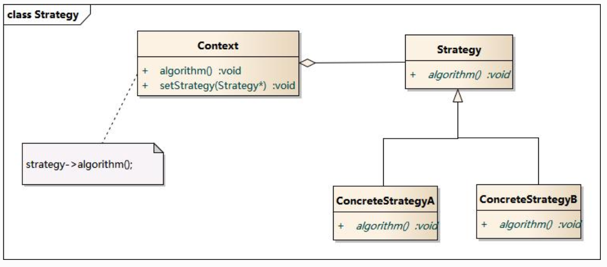

# 概览

### 一.项目介绍

项目开源地址：[https://github.com/trpc-group/trpc-go](https://github.com/trpc-group/trpc-go)。

目前最新的release版本是v1.0.2，后续内容基于此版本讲解。

trpc-go是一个高性能可插拔的rpc框架。

trpc-go具有以下特点：

* 一个进程内可以同时启动多个服务，并监听多个地址。
* 所有的组件都是可插拔的，内置了各种基本功能的默认实现，可以进行替换。其他组件可以由第三方实现并注册到框架中。
* 所有的接口都可以进行模拟测试，使用 gomock、mockgen 生成 mock 代码，方便进行测试。
* 框架支持任意的第三方协议，只需要实现协议的打包和解包接口即可。默认支持 trpc 和 http 协议，可以随时切换。
* 提供了 [trpc 命令行工具](https://github.com/trpc-group/trpc-cmdline) 用于生成代码模板。

### 二.项目背景

互联网发展早期，业务场景差异大，试错迭代速度很快。这导致其后台服务使用的语言技术栈、开发框架、通信协议、服务治理系统、运维平台等或多或少存在差异。

业务发展到一定阶段后，跨业务合作越来越多，组织架构调整也愈发频繁。技术体系差异，特别是开发框架的不统一，给业务互通带来巨大成本，也导致开发和运营的效率难以快速提高。

同时，随着云原生技术的发展，业务越来越多地使用开源技术和云组件。拥抱云原生已经是一种主流趋势。

上述问题在腾讯内部也同样存在，且因为规模大、业务类型多，更加难以解决，更必须解决。tRPC就是在这种背景下诞生的。

### 三.设计原则

既要与存量技术体系互联互通，又要适配云原生技术并且快速发展。这就要求开发框架必须具备开放性和可扩展性。为了达到这个目的，tRPC在架构设计上采用插件化设计思想。

tRPC插件化在整体设计上遵循如下的思想：

首先tRPC对框架整体进行分层和模块化，并把核心功能模块抽象封装成一个个独立的插件。然后由框架来负责这些独立插件的串联和拼装，从而实现框架所要支持的功能和特性。

在具体实现上，则采用以下的关键技术：

* 基于接口机制的插件工厂。
* 基于AOP思想的拦截器。

#### 1.插件工厂

插件工厂的整体实现思路是框架只定义插件的标准接口，并提供注册能力，不做具体实现。与外部服务互通，或者对接某个服务治理系统时，只需要开发对应的具体插件即可

<figure><figcaption>
名字服务插件
</figcaption></figure>

例如上方，框架对接不同名字服务系统，定义了统一的Registry和Selector抽象接口，对接不同的名字服务系统时只需要按照Registry和Selector接口即可实现即可。

通过插件工厂的设计，可以带来以下的好处:

* 对于框架侧: 框架只定义标准接口，没有任何插件实现，与具体平台完全解耦。
* 对于平台侧: 只需要按照框架插件标准接口即可实现插件，即可将平台的能力融入到框架中。
* 对于用户侧: 业务开发只需要通过配置进行使用，对用户透明。

#### 2.拦截器

为了使tRPC框架有更强的可扩展性，满足业务个性化的需求（比如metrics监控、日志收集、链路跟踪、参数校验、请求回放、故障注入等），tRPC借鉴了Java面向切面（AOP）的编程思想，支持了拦截器filter。

filter整体实现的思路是在框架处理RPC请求的流程上设置埋点，然后通过在埋点地方插入一系列的filter。具体实现上，不同语言有所不同，Cpp采用数组遍历的方式，Go采用递归的方式，Java采用链式的方式。

filter的最终目的是让业务逻辑与框架进行解耦，并允许各自进行内聚性开发，可以在不修改框架代码的情况下，给业务程序动态添加或替换个性化的功能。

### 四.总体架构

<figure><figcaption>
总体架构
</figcaption></figure>

总体架构由**框架核心**和**插件**两部分组成。 其中虚线框内为tRPC，中间的红色实线框为框架核心，蓝色框为插件部分。

框架核心又可以分三层:

* **通信层**: 负责数据的传输和协议的编解码，框架内置支持TCP、UDP等通信协议，传输协议采用基于Protobuf的tRPC协议来承载RPC调用，支持通过codec插件来使用其它传输协议。
* **服务治理层**: 负责将服务治理功能抽象成插件，通过调用插件和外部服务治理系统进行对接，实现服务发现、负载均衡、监控、调用链等功能。
* **调用层**: 封装服务和服务代理实体，提供RPC调用接口，支持业务用同步、异步、单向以及流式调用等方式进行服务间调用。

### 五.RPC调用流程

框架在横向上分为服务端和客户端，在纵向进行分层。其中，纵向上的服务端大致分为Transport、Codec、Service和Filter层，客户端分为Transport、Codec、ServiceProxy、Filter层，具体设计如下：

<figure><figcaption>
rpc调用流程
</figcaption></figure>

filter层(拦截器)，其主要目的是采用AOP的思想，把业务个性化的需求（比如：校验校验、请求回放、故障注入等）、以及服务治理的大部分功能(比如：监控指标上报，调用链跟踪，远程日志，鉴权等)以横切关注点的方式，插入到请求/响应处理的流程中，通过这样的设计来增强框架的可扩展性。

同时系统对每一层进行模块化拆分，采用插件化的实现，框架通过基于接口编程的思想，串联RPC调用的全流程。对于一些模块，框架也采用了更细粒度的模块拆分。比如：Selector模块被细分为服务发现、服务路由、负载均衡和熔断等子模块，Codec层也被细分为编解码、序列化、压缩三个子模块。

通过上面整体的分层设计，具体模块的插件化实现和细粒度的模块拆分，使框架具备很强的扩展性和开放性。业务可以灵活替换插件，实现与不同系统的对接，也可以进行业务个性化定制能力实现。
