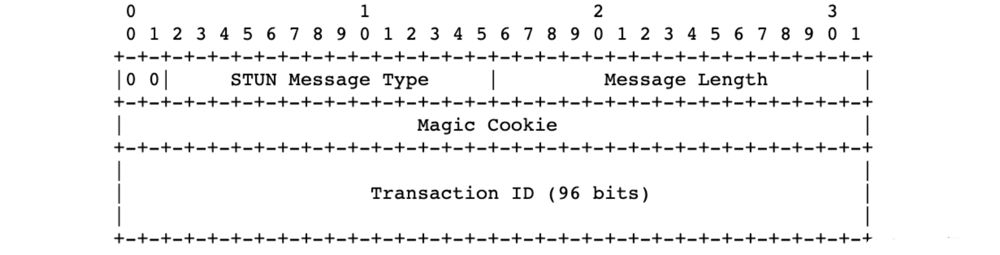

# 策略模式

### 一.图解

<figure><figcaption><p>类图</p></figcaption></figure>

当遇到较多if else，可以考虑使用策略模式。

```cpp
int main(int argc, char *argv[]) {
	Strategy* s1 = new ConcreteStrategyA();
	Context* cxt = new Context();
	cxt->setStrategy(s1);
	cxt->algorithm();

	Strategy* s2 = new ConcreteStrategyB();
	cxt->setStrategy(s2);
	cxt->algorithm();
	
	delete s1;
	delete s2;
}
```

<figure><figcaption><p>时序图</p></figcaption></figure>

### 二.特性

策略模式满足开闭原则，每当有新策略，新建一个子类即可。
